# 📦 Web Tabanlı Envanter Yönetim Sistemi

Bu proje, daha önce geliştirdiğim masaüstü envanter uygulamasının, **Python Flask** ve **MS SQL Server** mimarisi kullanılarak modern web teknolojilerine uyarlanmış halidir. Proje, güvenli veritabanı mimarisi, rol tabanlı yetkilendirme ve sürdürülebilir kod yapısı üzerine odaklanmaktadır.

  

## 🚀 Projenin Teknik Özellikleri

* **Güçlü Backend Mimarisi:** Python Flask framework'ü ile MVC (Model-View-Controller) yapısına uygun geliştirilmiştir.
* **İleri Seviye Veritabanı Yönetimi:** Güvenlik ve performans optimizasyonu için tüm CRUD (Ekleme, Okuma, Güncelleme, Silme) işlemlerinde **Stored Procedure (Saklı Yordamlar)** kullanılmıştır.
* **Rol Tabanlı Yetkilendirme (RBAC):** Yönetici (Admin) ve Standart Kullanıcılar için ayrıştırılmış panel ve yetki mekanizması.
* **Dinamik Hesap Statüsü ve Erişim Yönetimi (Advanced Access Control):**
    * **Pasif Hesaplar:** İşten ayrılan veya güvenliği ihlal eden personelin hesabı 'Pasif' duruma getirilir ve sisteme girişi (Login) veritabanı seviyesinde tamamen engellenir.
    * **Askıda/Beklemede Hesaplar:** Hesabı onay sürecinde olan kullanıcılar sisteme giriş yapabilir ancak **'Salt Okunur' (Read-Only)** modda çalışır. Veriler üzerinde ekleme/silme işlemi yapmaları engellenir.
* **Erişim Talep Mekanizması:** Yetkisi kısıtlı veya hesabı askıda olan kullanıcılar, panel üzerinden Admin'e **"Erişim İzni Talebi"** gönderebilir. Admin onayı sonrası kullanıcının işlem kısıtlamaları sistem tarafından otomatik olarak kaldırılır.
* **Güvenlik:** SQL Injection saldırılarına karşı parametrize edilmiş sorgular ve güvenli parola hashleme yöntemleri.
* **Dinamik Stok Takibi:** Ürün giriş-çıkışlarının anlık olarak izlenmesi ve raporlanması.

## 🗺️ Geliştirme Yol Haritası (Roadmap)

Proje, yazılım mühendisliği prensiplerine göre aktif olarak geliştirilmeye devam etmektedir. Aşağıdaki maddeler bir sonraki versiyon (v2.0) için planlanmıştır:

* **1. Yapay Zeka Destekli Stok Tahmini (AI Forecasting):**
    * Geçmiş kullanım verileri üzerinden Scikit-learn kütüphanesi ve Regresyon algoritmaları kullanılarak, gelecek ayın stok ihtiyacını tahmin eden bir AI modülü entegre edilecektir.
* **2. Transaction Yönetimi ve Loglama Refactoring:**
    * Veritabanı transaction yönetimi iyileştirilecektir. Veri bütünlüğünü (Data Integrity) tam sağlamak amacıyla, mevcut loglama mekanizması **"Write-Ahead Logging"** prensibine uygun olarak, işlem commit edilmeden önce kayıt alacak şekilde yeniden düzenlenecektir.
* **3. Arayüz Modernizasyonu:**
    * Frontend tarafında kullanıcı deneyimini (UX) artırmak için Responsive tasarım (Bootstrap/Tailwind) entegrasyonu yapılacaktır.

## 🛠️ Kullanılan Teknolojiler

* **Dil:** Python 3.x
* **Web Framework:** Flask
* **Veritabanı:** Microsoft SQL Server (T-SQL, Stored Procedures, Triggers)
* **Frontend:** HTML5, CSS3, Jinja2 Template Engine

## 📸 Ekran Görüntüleri (Screenshots)

<table style="width:600">
  <tr>
    <th width="200">Başlangıç Ekranı</th>
    <th width="200">Hesap Oluşturma Ekranı</th>
   <th width="200">Giriş Ekranı</th>
  </tr>
  <tr>
    <td align="center">
      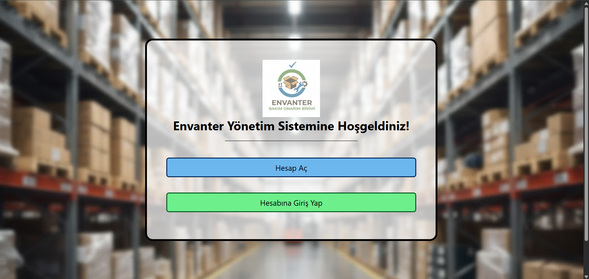
      <br>
      <em>Güvenli giriş ekranı</em>
    </td>
    <td align="center">
      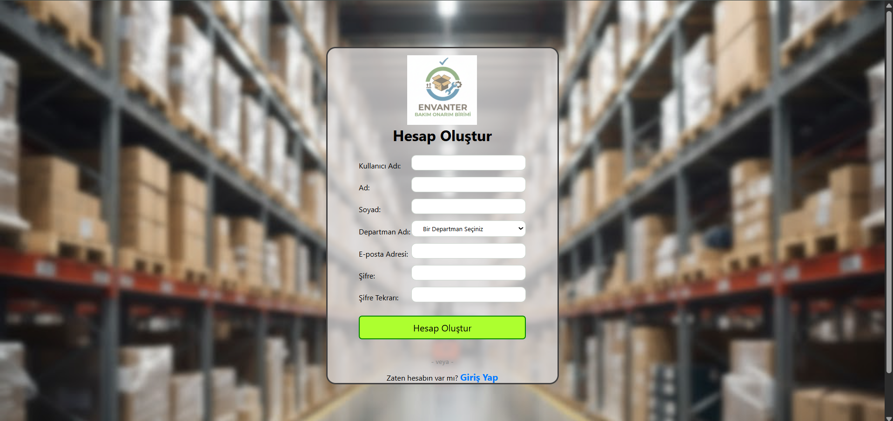
      <br>
      <em>Yeni hesap açma</em>
    </td>
     <td align="center">
      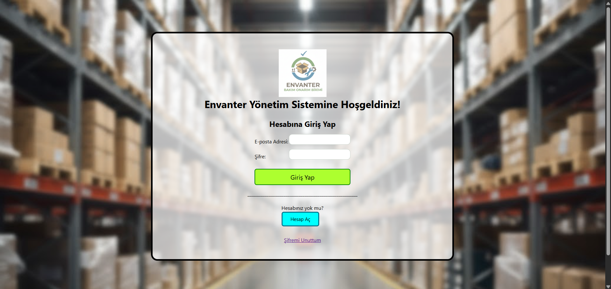
      <br>
      <em>Hesaba Girme</em>
    </td>
  </tr>
</table>

<table style="width:600">
  <tr>
    <th width="200">Admin AnaSayfası</th>
    <th width="200">User AnaSayfası</th>
     <th width="200">Profil Güncelleme Paneli</th>
  </tr>
  <tr>
    <td align="center">
      
      <br>
    </td>
    <td align="center">
      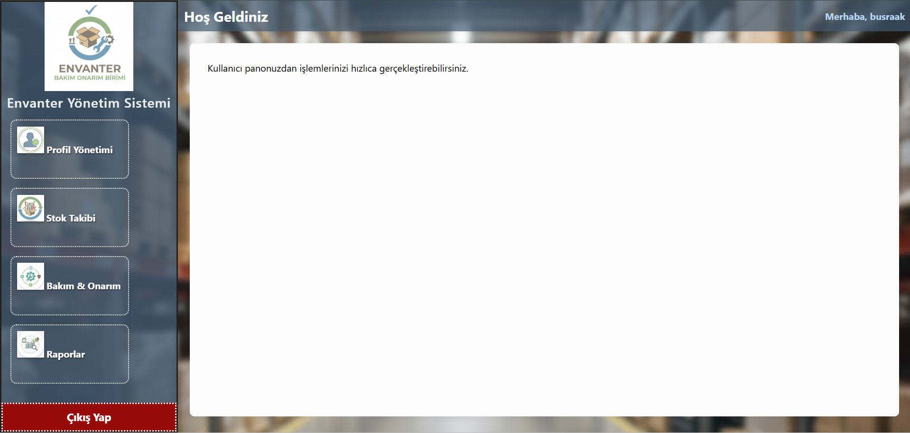
      <br>
    </td>
     <td align="center">
      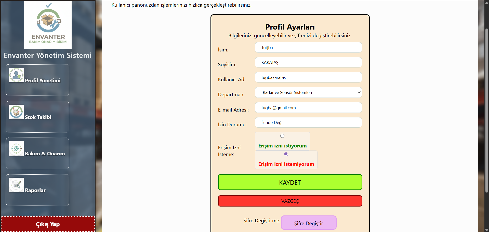
      <br>
    </td>
  </tr>
</table>

<table style="width:600">
  <tr>
    <th width="200">Stok Takibi Paneli</th>
    <th width="200">Bakım ve Onarım Paneli</th>
     <th width="200">Bakım Durumu Güncelleme</th>
  </tr>
  <tr>
    <td align="center">
      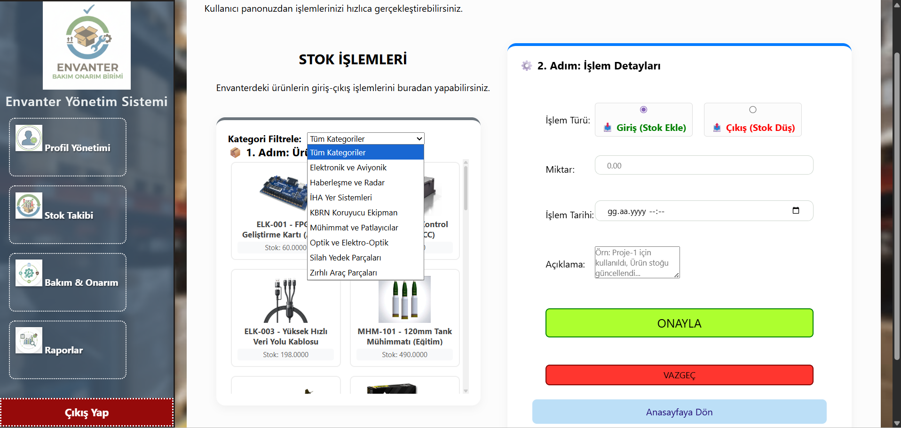
      <br>
    </td>
    <td align="center">
      
      <br>
    </td>
     <td align="center">
      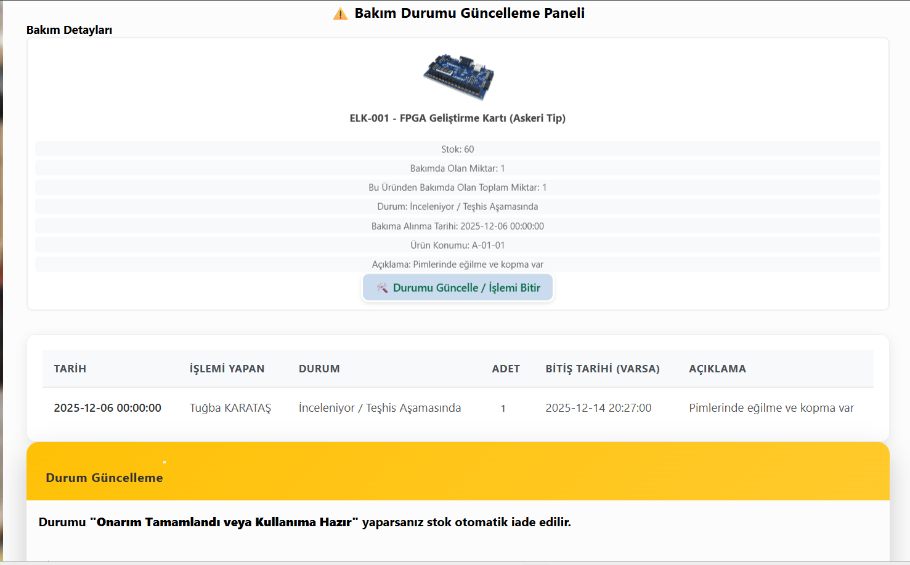
      <br>
    </td>
  </tr>
</table>

<table style="width:600">
  <tr>
    <th width="200">Arıza Kaydı Açma</th>
    <th width="200">Ürün Raporu</th>
     <th width="200">Log Kaydı Rporu(sadece admin için)</th>
  </tr>
  <tr>
    <td align="center">
      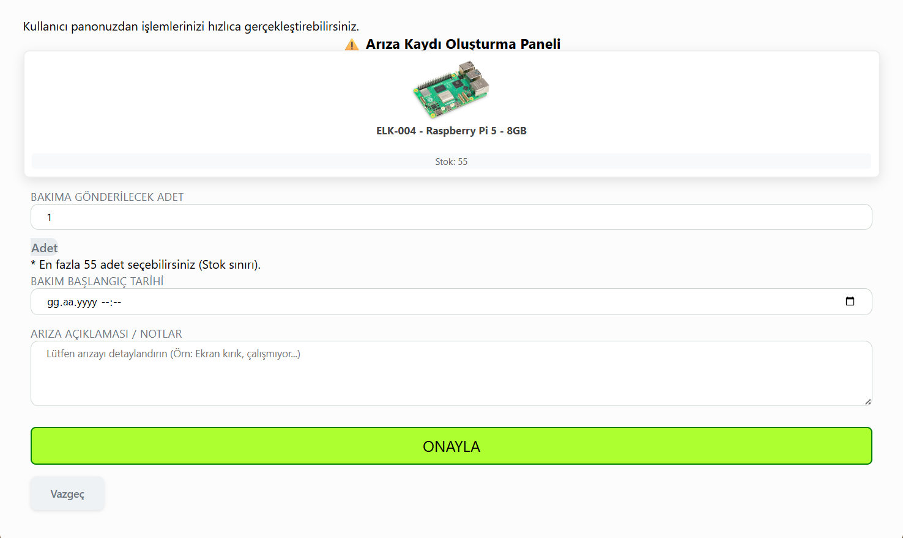
      <br>
    </td>
    <td align="center">
      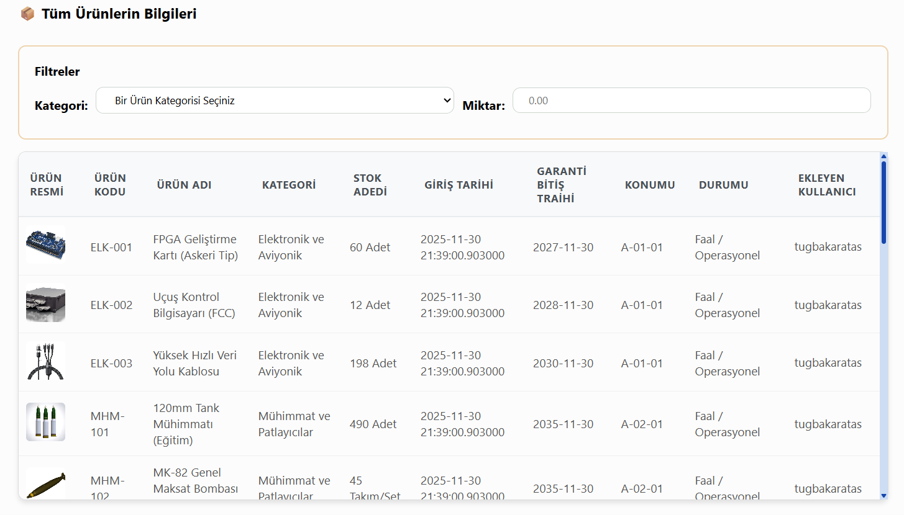
      <br>
    </td>
     <td align="center">
      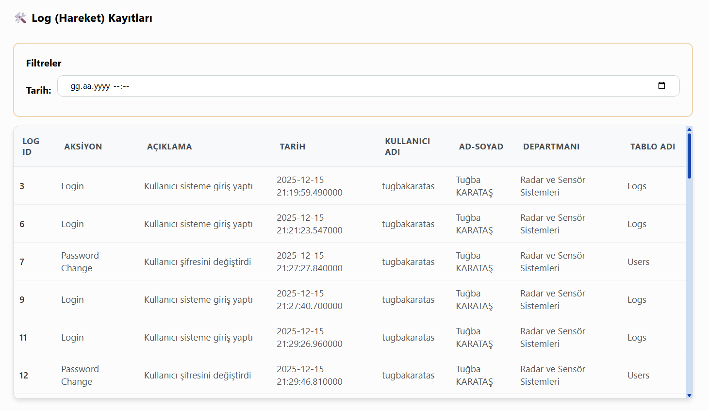
      <br>
    </td>
  </tr>
</table>

<table style="width:600">
  <tr>
    <th width="200">Yeni Ürün Ekleme İşlemi (sadece admin)</th>
    <th width="200">Ürün Güncelleme Paneli (sadece admin)</th>
     <th width="200">Güncelleme İşlemi (sadece admin)</th>
  </tr>
  <tr>
    <td align="center">
      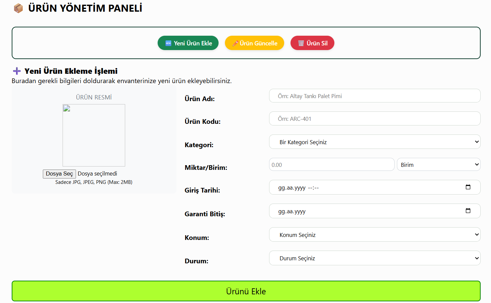
      <br>
    </td>
    <td align="center">
      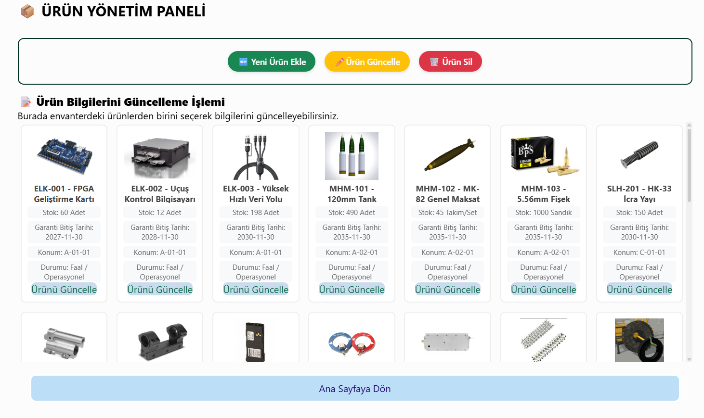
      <br>
    </td>
     <td align="center">
      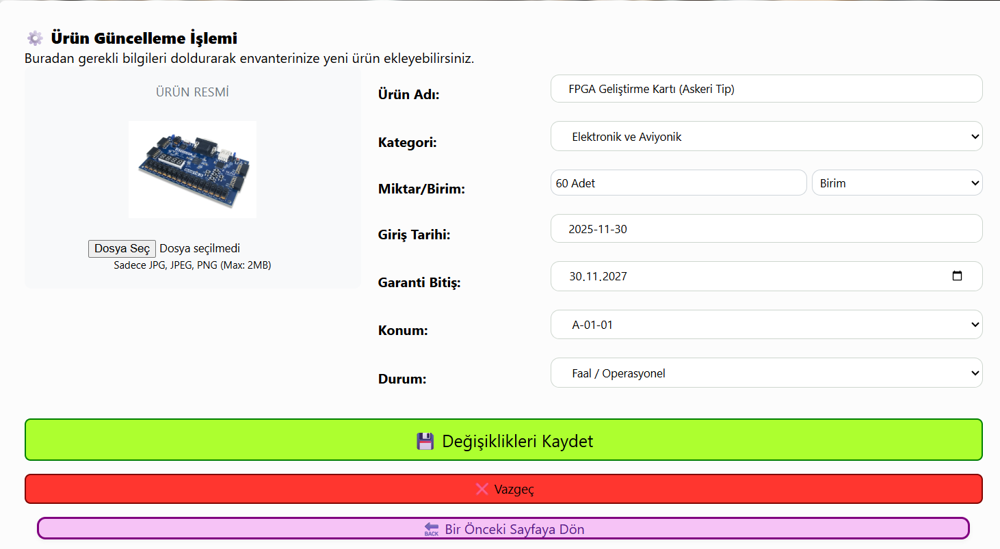
      <br>
    </td>
  </tr>
</table>

<table style="width:600">
  <tr>
    <th width="200">Kullanıcı Yönetim Paneli (sadece admin)</th>
    <th width="200">Kullanıcı Güncelleme Paneli (sadece admin)</th>
     <th width="200">Şifre Güncelleme İşlemi</th>
  </tr>
  <tr>
    <td align="center">
      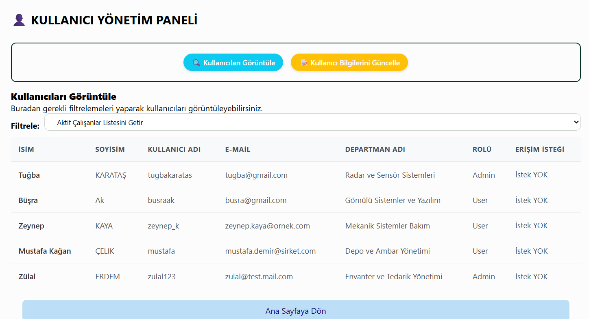
      <br>
    </td>
    <td align="center">
      
      <br>
    </td>
     <td align="center">
      
      <br>
    </td>
  </tr>
</table>
## ⚙️ Kurulum ve Çalıştırma

Projeyi yerel makinenizde çalıştırmak için aşağıdaki adımları izleyin:

1.  **Repoyu Klonlayın:**
    ```bash
    git clone [https://github.com/KULLANICI_ADIN/REPO_ADIN.git](https://github.com/KULLANICI_ADIN/REPO_ADIN.git)
    cd REPO_KLASORU
    ```

2.  **Gerekli Kütüphaneleri Yükleyin:**
    ```bash
    pip install -r requirements.txt
    ```

3.  **Veritabanını Kurun:**
    * `database` klasörü içindeki `.sql` dosyalarını (Tablo oluşturma, Stored Procedure ve Triggerlar) SQL Server Management Studio (SSMS) üzerinde çalıştırın.
    * Veritabanı bağlantı ayarlarını kendi sunucunuza göre yapılandırın.

4.  **Uygulamayı Başlatın:**
    ```bash
    python app.py
    ```
    ---
*Geliştirici: [Tuğba KARATAŞ]*

---
*Geliştirici: [Adın Soyadın]*
